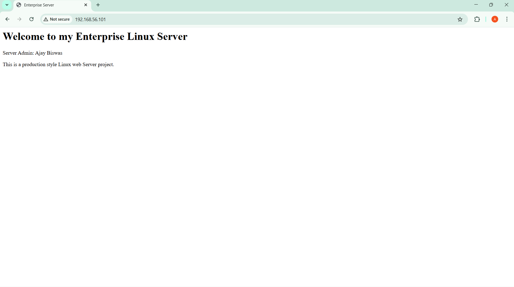
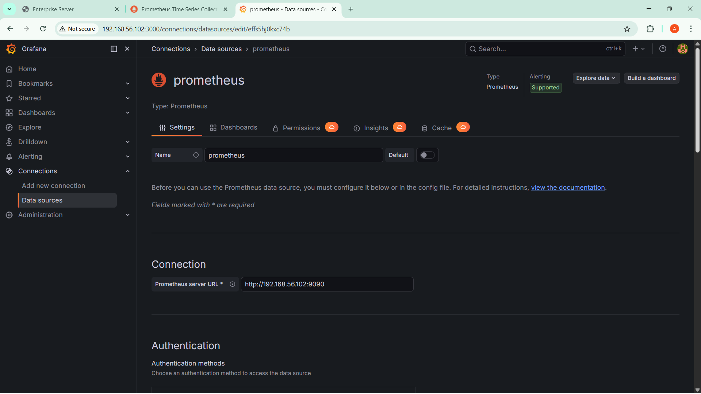
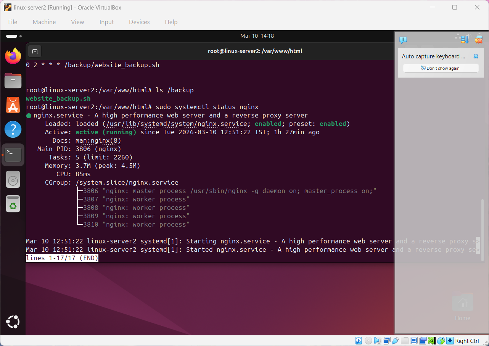

# Enterprise Linux Infrastructure Project

## Project Overview
This project demonstrates a real-world Linux server infrastructure setup used in enterprise environments.

## Architecture
Main Server (Reverse Proxy) - 192.168.198.144  
Web Server - 192.168.56.101  
Monitoring Server (Prometheus + Grafana) - 192.168.56.102  
Backup Server (rsync automation) - 192.168.56.103  

## Technologies Used
- Linux
- Nginx
- Prometheus
- Grafana
- rsync
- SSH

## Features
- Reverse Proxy configuration
- Web hosting server
- Infrastructure monitoring
- Automated backup system
- Secure SSH communication

---

## Screenshots

### Nginx Web Server

### Prometheus Monitoring

### Grafana Dashboard

### Backup Automation

